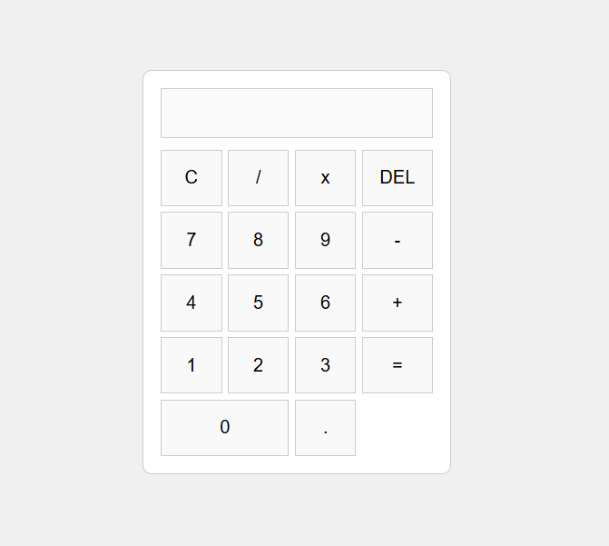

# 🧮 Simple Calculator

A clean and minimal web-based calculator built using **HTML**, **CSS**, and **JavaScript**. Supports basic arithmetic operations such as addition, subtraction, multiplication, and division.

---

## 🚀 Live Demo

🔗 [Click here to try the Calculator](https://sarbeswarbhol.github.io/Calculator/) 

---

## 📸 Screenshot

  

---

## ✨ Features

- Basic arithmetic operations: `+`, `-`, `*`, `/`
- Clear display button (`C`)
- Delete last digit (`DEL`)
- Decimal support
- Responsive and clean UI
- Keyboard-free input (button clicks only)

---

## 🛠️ Technologies Used

- **HTML5**
- **CSS3 (Grid Layout)**
- **Vanilla JavaScript**

---

## 💡 How It Works

- `appendValue(val)` — Adds the selected character to the display.
- `clearDisplay()` — Clears the entire input.
- `deleteLast()` — Deletes the last entered character.
- `calculate()` — Evaluates the expression using `eval()` and displays the result. Catches errors like invalid expressions.
